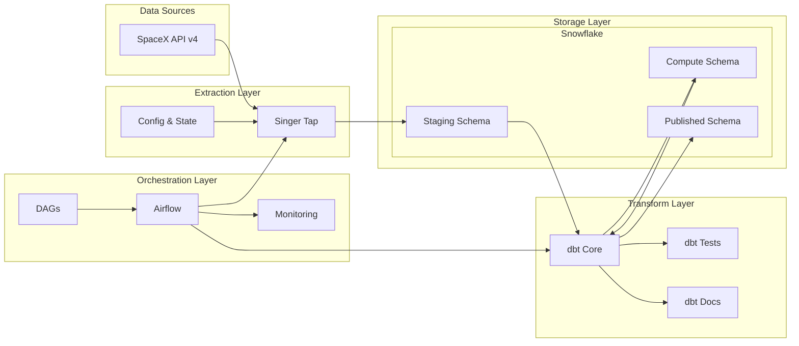

# SpaceX Data Pipeline Architecture

## System Architecture Diagram



## Component Details

### Data Sources

- **SpaceX API v4**: REST API providing SpaceX mission data
  - Endpoints for launches, rockets, cores, etc.
  - JSON response format
  - Rate-limited access

### Extraction Layer

- **Singer Tap**: Custom tap for SpaceX API
  - Incremental extraction
  - State management
  - JSON output

### Storage Layer (Snowflake)

- **Staging Schema (STG)**

  - Raw data landing
  - Minimal transformations
  - Source of truth

- **Compute Schema (CMP)**

  - Bridge tables
  - Intermediate calculations
  - Business logic implementation

- **Published Schema (PBL)**
  - Dimension tables (Type 2 SCD)
    - Surrogate keys
    - Temporal validity
    - Change tracking
    - 13 dimension tables
  - Fact tables
    - Launch facts
    - Cost metrics
    - Starlink tracking

### Transform Layer (dbt)

- **dbt Core**

  - SQL transformations
  - Modular models
  - Dependencies management

- **dbt Tests**

  - Data quality checks
  - Schema tests
  - Custom business rules

- **dbt Docs**
  - Model documentation
  - Lineage graphs
  - Data dictionary

### Orchestration Layer (Airflow)

- **Airflow Core**

  - Task scheduling
  - Dependency management
  - Error handling

- **DAGs**

  - Pipeline definition
  - Task configuration
  - Retry logic

- **Monitoring**
  - Task status
  - Runtime metrics
  - Error tracking

## Data Flow

1. **Extraction Process**

   ```
   SpaceX API → Singer Tap → JSON Records → Snowflake STG
   ```

2. **Transformation Process**

   ```
   STG Tables → dbt Models → CMP Bridge Tables → SCD Type 2 Processing → PBL Dimensions & Facts
   ```

3. **Orchestration Process**
   ```
   Airflow DAG → Schedule Tasks → Monitor Execution → Handle Errors
   ```

## System Requirements

### Infrastructure

- Snowflake Account
- Airflow Environment
- Python 3.8+
- dbt Core

### Memory Requirements

- Minimum 4GB RAM
- 2 CPU cores
- 20GB storage

### Network

- Stable internet connection
- API rate limit compliance

## Security Considerations

### Authentication

- Snowflake credentials
- Airflow connections

### Authorization

- Role-based access
- Schema permissions
- Resource limitations
