# SpaceX Data Model - Column Level Lineage

## Core Launch Data Flow

```mermaid
flowchart TD
    %% Source Tables
    SRC_LAUNCHES[source_api.launches]
    SRC_ROCKETS[source_api.rockets]
    SRC_CORES[source_api.cores]

    %% Staging Tables
    STG_LAUNCHES[stg_spacex_data__launches]
    STG_ROCKETS[stg_spacex_data__rockets]
    STG_CORES[stg_spacex_data__cores]

    %% Intermediate Tables
    INT_LAUNCH_CORES[cmp_bridge__launch_cores]

    %% Final Tables
    FCT_LAUNCHES[pbl_spacex_data_fct__launches]
    DIM_ROCKETS[pbl_spacex_data_dim__rockets]
    DIM_CORES[pbl_spacex_data_dim__cores]

    %% Launch ID Lineage
    SRC_LAUNCHES.launch_id --> STG_LAUNCHES.launch_id
    STG_LAUNCHES.launch_id --> FCT_LAUNCHES.launch_id

    %% Rocket Data Lineage
    SRC_ROCKETS.id --> STG_ROCKETS.rocket_id
    SRC_ROCKETS.name --> STG_ROCKETS.rocket_name
    STG_ROCKETS.rocket_id --> DIM_ROCKETS.rocket_id
    STG_ROCKETS.rocket_name --> DIM_ROCKETS.rocket_name

    %% Core Data Lineage
    SRC_CORES.serial --> STG_CORES.core_serial
    STG_CORES.core_serial --> INT_LAUNCH_CORES.core_serial
    INT_LAUNCH_CORES.core_serial --> DIM_CORES.serial
```



## Payload and Dragon Data Flow

```mermaid
flowchart TD
    %% Source Tables
    SRC_PAYLOADS[source_api.payloads]
    SRC_DRAGONS[source_api.dragons]

    %% Staging Tables
    STG_PAYLOADS[stg_spacex_data__payloads]
    STG_DRAGONS[stg_spacex_data__dragons]

    %% Intermediate Tables
    INT_LAUNCH_PAYLOADS[cmp_bridge__launch_payloads]

    %% Final Tables
    FCT_LAUNCH_PAYLOADS[pbl_spacex_data_fct__launch_payloads]
    DIM_PAYLOADS[pbl_spacex_data_dim__payloads]
    DIM_DRAGONS[pbl_spacex_data_dim__dragons]

    %% Payload Data Lineage
    SRC_PAYLOADS.id --> STG_PAYLOADS.payload_id
    SRC_PAYLOADS.mass_kg --> STG_PAYLOADS.payload_mass_kg
    STG_PAYLOADS.payload_id --> INT_LAUNCH_PAYLOADS.payload_id
    INT_LAUNCH_PAYLOADS.payload_mass_kg --> FCT_LAUNCH_PAYLOADS.payload_mass_kg

    %% Dragon Data Lineage
    SRC_DRAGONS.id --> STG_DRAGONS.dragon_id
    SRC_DRAGONS.name --> STG_DRAGONS.dragon_name
    STG_DRAGONS.dragon_id --> DIM_DRAGONS.dragon_id
    STG_DRAGONS.dragon_name --> DIM_DRAGONS.name
```



## Crew and Ship Data Flow

```mermaid
flowchart TD
    %% Source Tables
    SRC_CREW[source_api.crew]
    SRC_SHIPS[source_api.ships]

    %% Staging Tables
    STG_CREW[stg_spacex_data__crew]
    STG_SHIPS[stg_spacex_data__ships]

    %% Intermediate Tables
    INT_LAUNCH_CREW[cmp_bridge__launch_crew]
    INT_LAUNCH_SHIPS[cmp_bridge__launch_ships]

    %% Final Tables
    FCT_LAUNCH_CREW[pbl_spacex_data_fct__launch_crew]
    FCT_LAUNCH_SHIPS[pbl_spacex_data_fct__launch_ships]
    DIM_CREW[pbl_spacex_data_dim__crew]
    DIM_SHIPS[pbl_spacex_data_dim__ships]

    %% Crew Data Lineage
    SRC_CREW.id --> STG_CREW.crew_id
    SRC_CREW.name --> STG_CREW.crew_name
    STG_CREW.crew_id --> INT_LAUNCH_CREW.crew_id
    INT_LAUNCH_CREW.crew_id --> FCT_LAUNCH_CREW.crew_id

    %% Ship Data Lineage
    SRC_SHIPS.id --> STG_SHIPS.ship_id
    SRC_SHIPS.name --> STG_SHIPS.ship_name
    STG_SHIPS.ship_id --> INT_LAUNCH_SHIPS.ship_id
    INT_LAUNCH_SHIPS.ship_id --> FCT_LAUNCH_SHIPS.ship_id
```



## Detailed Column Transformations

### FCT_LAUNCHES Table

```yaml
columns:
  launch_id:
    source: source.launches.id
    transformation: direct copy

  flight_number:
    source: source.launches.flight_number
    transformation: direct copy

  mission_name:
    source: source.launches.name
    transformation: direct copy

  launch_date_utc:
    source: source.launches.date_utc
    transformation: |
      convert_timezone('UTC', date_utc)

  success:
    source: source.launches.success
    transformation: direct copy

  core_count:
    source: int_launch_cores
    transformation: |
      COUNT(DISTINCT core_serial)
      GROUP BY launch_id

  total_payload_mass_kg:
    source: int_launch_payloads
    transformation: |
      SUM(payload_mass_kg)
      GROUP BY launch_id
```

### FCT_LAUNCH_COSTS Table

```yaml
columns:
  launch_id:
    source: fct_launches.launch_id
    transformation: direct copy

  base_launch_cost:
    source: dim_rockets.cost_per_launch
    transformation: direct copy

  estimated_launch_cost:
    sources:
      - dim_rockets.cost_per_launch
      - fct_launches.reused_core_count
      - fct_launches.core_count
    transformation: |
      cost_per_launch * (1 - (0.3 * reused_core_count/core_count))

  cost_per_kg:
    sources:
      - estimated_launch_cost
      - total_payload_mass_kg
    transformation: |
      CASE 
          WHEN total_payload_mass_kg > 0 
          THEN estimated_launch_cost / total_payload_mass_kg
          ELSE NULL 
      END
```

### DIM_ROCKETS Table

```yaml
columns:
  rocket_id:
    source: source.rockets.id
    transformation: direct copy

  rocket_name:
    source: source.rockets.name
    transformation: direct copy

  rocket_type:
    source: source.rockets.type
    transformation: direct copy

  height_meters:
    source: source.rockets.height.meters
    transformation: direct copy

  cost_per_launch:
    source: source.rockets.cost_per_launch
    transformation: direct copy
```

## Key Transformation Rules

1. **ID Fields**

   - All source IDs are converted to UUIDs in staging
   - Relationships maintained through all layers
   - New IDs generated for bridge tables

2. **Date/Time Fields**

   - All dates standardized to UTC in staging
   - Timezone information preserved where relevant
   - Additional date dimensions created in mart layer

3. **Numeric Calculations**

   - Core counts aggregated from bridge tables
   - Costs calculated with reusability factors
   - Payload masses summed at launch level

4. **Status Fields**

   - Standardized to consistent values in staging
   - Historical status tracking in dimension tables
   - Current status maintained in fact tables

5. **Naming Conventions**
   - Source names preserved in staging
   - Business names applied in mart layer
   - Consistent suffixes for similar fields

## Data Quality Checks

1. **Referential Integrity**

   ```sql
   -- Example check for launch references
   SELECT COUNT(*)
   FROM fct_launches l
   LEFT JOIN dim_rockets r ON l.rocket_id = r.rocket_id
   WHERE r.rocket_id IS NULL;
   ```

2. **Completeness Checks**

   ```sql
   -- Example check for required fields
   SELECT COUNT(*)
   FROM fct_launches
   WHERE launch_date_utc IS NULL
      OR mission_name IS NULL;
   ```

3. **Business Rule Validation**
   ```sql
   -- Example check for cost calculations
   SELECT COUNT(*)
   FROM fct_launch_costs
   WHERE estimated_launch_cost > base_launch_cost
      OR cost_per_kg < 0;
   ```

## Usage Examples

1. **Launch Success Analysis**

   ```sql
   SELECT
       r.rocket_name,
       COUNT(*) as total_launches,
       SUM(CASE WHEN l.success THEN 1 ELSE 0 END) as successful_launches
   FROM fct_launches l
   JOIN dim_rockets r ON l.rocket_id = r.rocket_id
   GROUP BY r.rocket_name;
   ```

2. **Cost Efficiency Analysis**
   ```sql
   SELECT
       r.rocket_name,
       AVG(lc.cost_per_kg) as avg_cost_per_kg,
       COUNT(DISTINCT l.launch_id) as launch_count
   FROM fct_launches l
   JOIN fct_launch_costs lc ON l.launch_id = lc.launch_id
   JOIN dim_rockets r ON l.rocket_id = r.rocket_id
   GROUP BY r.rocket_name;
   ```
