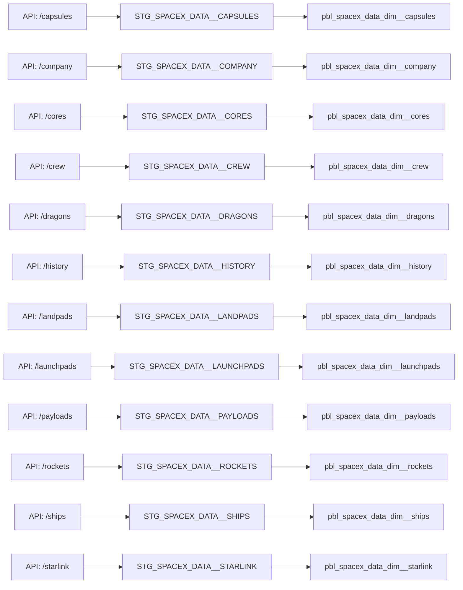
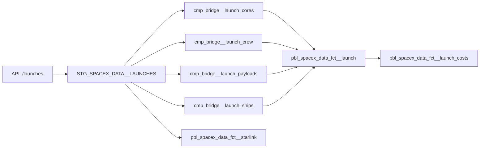

# SpaceX Data Lineage and Quality Documentation

## Data Lineage Overview

### Source to Target Mappings

#### Dimension Tables (SCD Type 2)

All dimension tables implement Type 2 Slowly Changing Dimension pattern with:

- Surrogate keys for versioning
- valid_from/valid_to timestamps
- is_current flag
- Change detection logic
- Initial load handling

#### Fact and Bridge Tables

## Data Quality Rules

### Common Rules for All SCD Type 2 Dimension Tables

| Column        | Rule                               | Severity |
| ------------- | ---------------------------------- | -------- |
| surrogate_key | Not null, Unique                   | Error    |
| natural_key   | Not null                           | Error    |
| valid_from    | Not null, <= current_timestamp     | Error    |
| valid_to      | > valid_from or '9999-12-31'       | Error    |
| is_current    | Not null, One true per natural_key | Error    |

### Staging Layer Rules

#### STG_SPACEX_DATA\_\_CAPSULES

| Column         | Rule             | Severity |
| -------------- | ---------------- | -------- |
| capsule_id     | Not null, Unique | Error    |
| capsule_status | Accepted values  | Warning  |

#### STG_SPACEX_DATA\_\_CORES

| Column      | Rule             | Severity |
| ----------- | ---------------- | -------- |
| core_id     | Not null, Unique | Error    |
| core_status | Accepted values  | Warning  |

#### STG_SPACEX_DATA\_\_CREW

| Column      | Rule             | Severity |
| ----------- | ---------------- | -------- |
| crew_id     | Not null, Unique | Error    |
| crew_status | Accepted values  | Warning  |

#### STG_SPACEX_DATA\_\_DRAGONS

| Column        | Rule             | Severity |
| ------------- | ---------------- | -------- |
| dragon_id     | Not null, Unique | Error    |
| crew_capacity | >= 0             | Warning  |

#### STG_SPACEX_DATA\_\_HISTORY

| Column         | Rule                 | Severity |
| -------------- | -------------------- | -------- |
| history_id     | Not null, Unique     | Error    |
| event_date_utc | Not null, Not future | Error    |

#### STG_SPACEX_DATA\_\_LANDPADS

| Column           | Rule                 | Severity |
| ---------------- | -------------------- | -------- |
| landpad_id       | Not null, Unique     | Error    |
| landing_attempts | >= landing_successes | Error    |

#### STG_SPACEX_DATA\_\_LAUNCHES

| Column                | Rule                 | Severity |
| --------------------- | -------------------- | -------- |
| launch_id             | Not null, Unique     | Error    |
| launch_date_utc       | Not null, Not future | Error    |
| launch_date_precision | Accepted values      | Warning  |

#### STG_SPACEX_DATA\_\_LAUNCHPADS

| Column           | Rule                | Severity |
| ---------------- | ------------------- | -------- |
| launchpad_id     | Not null, Unique    | Error    |
| launchpad_status | Accepted values     | Warning  |
| launch_attempts  | >= launch_successes | Error    |

#### STG_SPACEX_DATA\_\_PAYLOADS

| Column     | Rule              | Severity |
| ---------- | ----------------- | -------- |
| payload_id | Not null, Unique  | Error    |
| mass_kg    | > 0 when not null | Warning  |

#### STG_SPACEX_DATA\_\_SHIPS

| Column  | Rule             | Severity |
| ------- | ---------------- | -------- |
| ship_id | Not null, Unique | Error    |
| roles   | Not empty array  | Warning  |

#### STG_SPACEX_DATA\_\_STARLINK

| Column    | Rule              | Severity |
| --------- | ----------------- | -------- |
| id        | Not null, Unique  | Error    |
| height_km | > 0 when not null | Warning  |

### Compute Layer Rules

#### CMP_BRIDGE\_\_LAUNCH_CORES

| Column                       | Rule                     | Severity |
| ---------------------------- | ------------------------ | -------- |
| bridge_launch_core_launch_id | Not null, FK to launches | Error    |
| bridge_launch_core_id        | Not null, FK to cores    | Error    |
| landing_success              | Not null                 | Warning  |

#### CMP_BRIDGE\_\_LAUNCH_CREW

| Column                       | Rule                     | Severity |
| ---------------------------- | ------------------------ | -------- |
| bridge_launch_crew_launch_id | Not null, FK to launches | Error    |
| bridge_launch_crew_member_id | Not null, FK to crew     | Error    |
| role                         | Not null                 | Warning  |

#### CMP_BRIDGE\_\_LAUNCH_PAYLOADS

| Column                          | Rule                     | Severity |
| ------------------------------- | ------------------------ | -------- |
| bridge_launch_payload_launch_id | Not null, FK to launches | Error    |
| bridge_launch_payload_id        | Not null, FK to payloads | Error    |
| payload_type                    | Not null                 | Warning  |

#### CMP_BRIDGE\_\_LAUNCH_SHIPS

| Column                       | Rule                     | Severity |
| ---------------------------- | ------------------------ | -------- |
| bridge_launch_ship_launch_id | Not null, FK to launches | Error    |
| bridge_launch_ship_id        | Not null, FK to ships    | Error    |

### Published Layer Rules

#### Common Rules for All Dimension Tables

| Column        | Rule                               | Severity |
| ------------- | ---------------------------------- | -------- |
| surrogate_key | Not null, Unique                   | Error    |
| natural_key   | Not null                           | Error    |
| valid_from    | Not null, <= current_timestamp     | Error    |
| valid_to      | > valid_from or '9999-12-31'       | Error    |
| is_current    | Not null, One true per natural_key | Error    |

#### PBL_SPACEX_DATA_FCT\_\_LAUNCH

| Column          | Rule                 | Severity |
| --------------- | -------------------- | -------- |
| launch_id       | PK, FK to launches   | Error    |
| rocket_id       | FK to rockets        | Error    |
| launchpad_id    | FK to launchpads     | Error    |
| launch_date_utc | Not null, Not future | Error    |
| success         | Not null             | Warning  |

#### PBL_SPACEX_DATA_FCT\_\_LAUNCH_COSTS

| Column                | Rule                     | Severity |
| --------------------- | ------------------------ | -------- |
| launch_id             | PK, FK to launches       | Error    |
| total_payload_mass_kg | Between [0,50000[        | Error    |
| launch_cost_usd       | > 0                      | Error    |
| cost_per_kg           | launch_cost/mass if mass | Warning  |

#### PBL_SPACEX_DATA_FCT\_\_STARLINK

| Column       | Rule               | Severity |
| ------------ | ------------------ | -------- |
| starlink_id  | PK, FK to starlink | Error    |
| launch_id    | FK to launches     | Error    |
| height_km    | > 0 when not null  | Warning  |
| velocity_kms | > 0 when not null  | Warning  |

## Data Quality Monitoring

### Volume Checks

- Daily record counts by table
- Change percentage alerts
- Missing data detection

### Freshness Checks

- Source data latency < 24 hours
- Transformation completion time
- End-to-end pipeline SLA

### Accuracy Checks

- Referential integrity
- Business rule compliance
- Historical trend analysis

## Data Quality Alerts

### Error Level Alerts

- Primary key violations
- Foreign key violations
- Null in required fields
- Data type mismatches

### Warning Level Alerts

- Unusual value distributions
- Threshold breaches
- Performance degradation

## Data Quality Dashboard Metrics

### Pipeline Health

- Success rate by table
- Error count by severity
- Resolution time tracking

### Data Quality Scores

- Completeness score
- Accuracy score
- Consistency score

### Trend Analysis

- Quality score trends
- Error rate trends
- Volume trends

## Recovery Procedures

### Data Quality Issues

1. Identify affected records
2. Assess impact scope
3. Apply correction rules
4. Validate fixes
5. Update documentation

### Pipeline Failures

1. Stop dependent jobs
2. Fix root cause
3. Backfill data
4. Verify integrity
5. Resume pipeline

## Best Practices

### Data Loading

- Use incremental loads where possible
- Validate before transformation
- Maintain audit logs

### Data Transformation

- Document assumptions
- Include data quality checks
- Monitor performance impact

### Quality Monitoring

- Regular audits
- Proactive alerting
- Trend analysis
- Documentation updates
