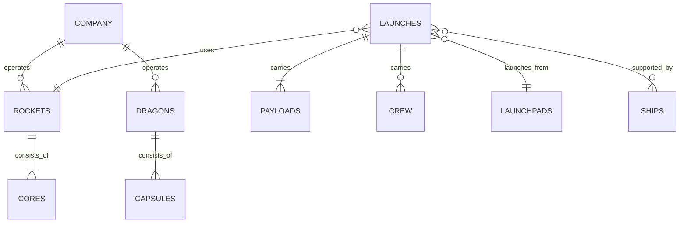
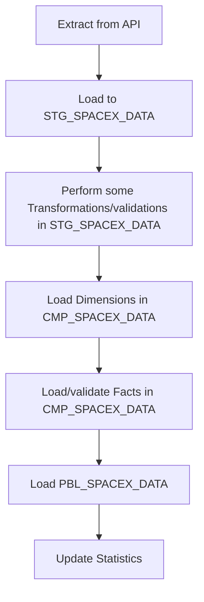

# SpaceX Data Model Documentation

## Table of Contents

1. [Conceptual Data Model](#conceptual-data-model)
2. [Logical Data Model](#logical-data-model)
3. [Physical Data Model](#physical-data-model)
4. [Processing Model](#processing-model)
5. [Processing Model](#processing-model)

## Conceptual Data Model

### Overview

The SpaceX data model represents the complete operational ecosystem of SpaceX, including launches, vehicles, facilities, and missions.

### Core Business Concepts

#### Mission Operations

- **Launches**: Primary operational events
- **Payloads**: Cargo and satellites deployed
- **Crew**: Personnel involved in missions
- **Vehicles**: Hardware used in missions

#### Assets and Infrastructure

- **Rockets**: Launch vehicles
- **Dragons**: Spacecraft
- **Launch Facilities**: Launch sites and support infrastructure
- **Recovery Assets**: Ships and landing pads

#### Company Information

- **Company Details**: Corporate information
- **Historical Events**: Significant milestones
- **Starlink**: Satellite constellation program

### Entity Relationships



## Logical Data Model

### Dimension Tables

#### Core Dimensions

1. **DIM_COMPANY**

   - Company information
   - Key metrics and valuations
   - Leadership structure

2. **DIM_ROCKETS**

   - Rocket specifications
   - Performance metrics
   - Manufacturing details

3. **DIM_DRAGONS**
   - Dragon spacecraft details
   - Capabilities
   - Technical specifications

#### Support Dimensions

1. **DIM_LAUNCHPADS**

   - Location details
   - Operational status
   - Launch capabilities

2. **DIM_SHIPS**
   - Recovery vessel information
   - Operational status
   - Capabilities

#### Component Dimensions

1. **DIM_CORES**

   - Reusable core details
   - Flight history
   - Status tracking

2. **DIM_CAPSULES**
   - Capsule specifications
   - Reuse information
   - Mission compatibility

### Fact Tables

1. **FACT_LAUNCHES**

   - Launch events
   - Mission outcomes
   - Related dimensions

2. **FACT_PAYLOADS**

   - Payload details
   - Orbital parameters
   - Customer information

3. **FACT_STARLINK**
   - Satellite tracking
   - Operational status
   - Orbital position

## Physical Data Model

### Data Types and Conventions

#### Standard Data Types

- Strings: VARCHAR/STRING
- Dates: TIMESTAMP_NTZ
- Numbers: INTEGER/FLOAT
- Complex Data: VARIANT

#### Naming Conventions

- Tables: UPPER_CASE
- Primary Keys: [table_name]\_ID
- Foreign Keys: Referenced dimension key name
- Timestamps: \_AT suffix

## Processing Model

### Data Flow


1. **Extraction Layer**

   - SpaceX API connections
   - Rate limiting handling
   - Error management

2. **Staging Layer**

   - Data cleansing
   - Type conversion
   - Relationship mapping

3. **Transform Layer**

   - Dimension loading
   - Fact table population
   - Historical tracking

4. **Published Layer**

   - Views creation on top of dimension tables
   - Views creation on top of fact tables
   - Views creation on top of historical tracking

### ETL Process Flow



### Incremental Processing

1. **Change Detection**

   - Timestamp-based tracking
   - Hash comparison
   - Delta identification

2. **Update Strategy**

   - Dimension: Slowly Changing Dimension (Type 2)
   - Facts: Append-only
   - History: Full preservation

3. **Error Handling**
   ```sql
   CREATE TABLE LOAD_ERRORS (
       TABLE_NAME STRING,
       ERROR_MESSAGE STRING,
       ERROR_DATA STRING,
       ERROR_TIME TIMESTAMP_NTZ
   );
   ```

### Quality Control

1. **Data Validation**

   - Schema compliance
   - Referential integrity
   - Business rules

2. **Monitoring**

   - Load statistics
   - Error tracking
   - Performance metrics

3. **Recovery Procedures**
   - Error logging
   - Retry logic
   - Rollback capabilities
