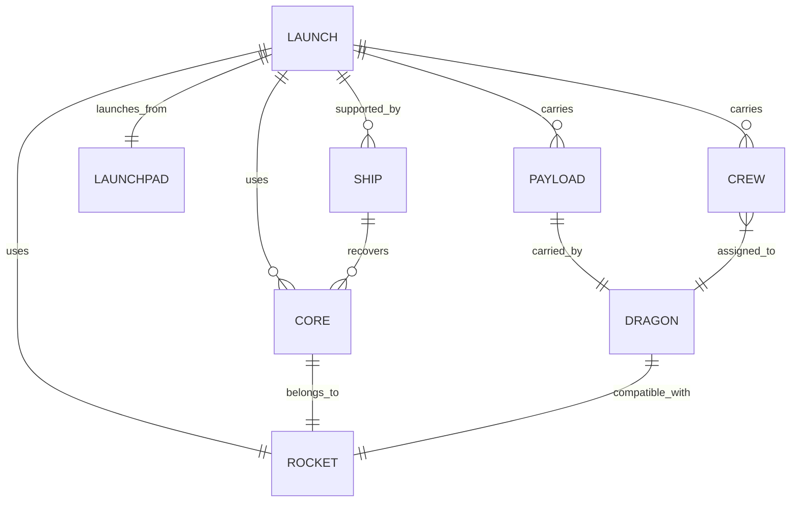
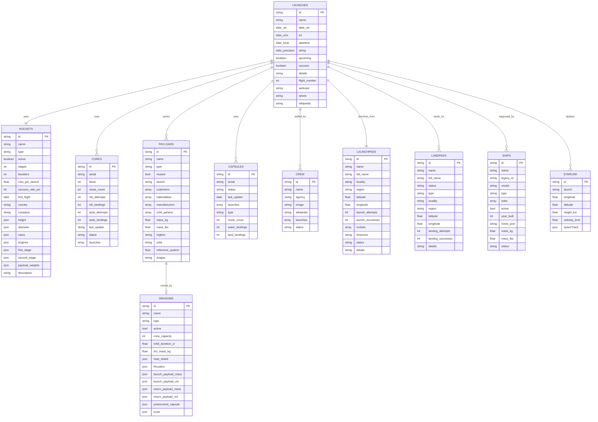

# SpaceX Data Model Documentation

## Entity Relationships Diagram

## Conceptual Model

### Core Entities

1. Launch

   - Represents a SpaceX launch mission
   - Contains mission details, timing, and success status

2. Rocket

   - Represents a rocket type (e.g., Falcon 9, Falcon Heavy)
   - Contains specifications and capabilities

3. Core

   - Represents individual rocket cores/boosters
   - Tracks reuse and recovery information

4. Payload

   - Represents cargo being launched
   - Contains weight, type, and customer information

5. Dragon

   - Represents Dragon spacecraft
   - Contains capsule specifications and mission capability

6. Launchpad

   - Represents launch facilities
   - Contains location and status information

7. Ship

   - Represents recovery vessels
   - Contains vessel specifications and recovery capabilities

8. Crew
   - Represents astronauts
   - Contains biographical and mission role information

## Logical Model

### Launch

- launch_id (PK)
- flight_number
- name
- date_utc
- date_local
- date_precision
- rocket_id (FK)
- launchpad_id (FK)
- success
- details
- upcoming
- static_fire_date_utc
- window
- net
- failure_time
- failure_altitude
- failure_reason
- ...

### Rocket

- rocket_id (PK)
- name
- type
- description
- height_meters
- diameter_meters
- mass_kg
- stages
- boosters
- cost_per_launch
- success_rate_pct
- first_flight
- country
- company
- active

### Core

- core_id (PK)
- rocket_id (FK)
- serial
- block
- status
- reuse_count
- rtls_attempts
- rtls_landings
- asds_attempts
- asds_landings
- last_update
- launches (FK_array to Launch)

### Payload

- payload_id (PK)
- launch_id (FK)
- dragon_id (FK)
- name
- type
- mass_kg
- orbit
- reference_system
- regime
- longitude
- semi_major_axis_km
- eccentricity
- periapsis_km
- apoapsis_km
- inclination_deg
- period_min
- lifespan_years
- epoch
- mean_motion
- raan
- customers (array)
- nationalities (array)
- manufacturers (array)

### Dragon

- dragon_id (PK)
- name
- type
- crew_capacity
- sidewall_angle_deg
- orbit_duration_yr
- dry_mass_kg
- first_flight
- heat_shield_material
- heat_shield_size_meters
- heat_shield_temp_degrees
- thrusters_number
- trunk_volume_cubic_meters
- trunk_solar_array
- trunk_unpressurized_cargo

### Launchpad

- launchpad_id (PK)
- name
- full_name
- locality
- region
- latitude
- longitude
- launch_attempts
- launch_successes
- rockets (FK_array to Rocket)
- status
- details

### Ship

- ship_id (PK)
- name
- legacy_id
- model
- type
- roles (array)
- active
- imo
- mmsi
- abs
- class
- mass_kg
- year_built
- home_port
- status
- speed_kn
- course_deg
- latitude
- longitude
- last_ais_update

### Crew

- crew_id (PK)
- name
- agency
- image
- wikipedia
- launches (FK_array to Launch)
- status
- dragon_id (FK)

## Physical Model

### Bridge Tables

#### LaunchCore

- launch_core_id (PK)
- launch_id (FK)
- core_id (FK)
- flight_number
- landing_success
- landing_type
- landing_vehicle

#### LaunchCrew

- launch_crew_id (PK)
- launch_id (FK)
- crew_id (FK)
- role

#### LaunchShip

- launch_ship_id (PK)
- launch_id (FK)
- ship_id (FK)
- role

#### RocketLaunchpad

- rocket_launchpad_id (PK)
- rocket_id (FK)
- launchpad_id (FK)

### Cardinality Details

1. Launch to Core: Many-to-Many

   - A launch can use multiple cores (Falcon Heavy uses 3)
   - A core can be used in multiple launches (reusability)

2. Launch to Payload: One-to-Many

   - A launch can carry multiple payloads
   - A payload belongs to one launch

3. Launch to Launchpad: Many-to-One

   - A launch uses one launchpad
   - A launchpad hosts many launches

4. Launch to Rocket: Many-to-One

   - A launch uses one rocket type
   - A rocket type is used in many launches

5. Launch to Crew: Many-to-Many

   - A launch can have multiple crew members
   - A crew member can participate in multiple launches

6. Launch to Ship: Many-to-Many

   - A launch can be supported by multiple ships
   - A ship can support multiple launches

7. Core to Rocket: Many-to-One

   - A core belongs to one rocket type
   - A rocket type can have many cores

8. Payload to Dragon: Many-to-One

   - A payload can be carried by one Dragon capsule
   - A Dragon capsule can carry multiple payloads (across missions)

9. Dragon to Rocket: Many-to-One

   - A Dragon capsule is compatible with one rocket type
   - A rocket type can launch multiple Dragon capsules

10. Ship to Core: Many-to-Many

    - A ship can recover multiple cores
    - A core can be recovered by multiple ships (different attempts)

11. Crew to Dragon: Many-to-One
    - Crew members are assigned to one Dragon capsule per mission
    - A Dragon capsule can have multiple crew members

### Implementation Notes

1. Primary Keys:

   - Use UUID or BIGSERIAL for all ID fields
   - Maintain natural keys (like serial numbers) as unique constraints

2. Foreign Keys:

   - Implement with ON DELETE RESTRICT
   - Index all foreign key columns

3. Arrays:

   - Use native array types for simple lists
   - Consider junction tables for complex relationships

4. Temporal Data:

   - Use timestamp with time zone for all date/time fields
   - Implement historical tracking where needed

5. Geographical Data:

   - Use appropriate spatial data types for coordinates
   - Consider PostGIS extension for advanced spatial queries

6. Text Fields:

   - Use VARCHAR(n) for known-length strings
   - Use TEXT for variable-length content

7. Numeric Data:

   - Use DECIMAL for financial values
   - Use REAL for scientific measurements
   - Use INTEGER for counters and simple numbers

8. Status Fields:
   - Implement as ENUM types where appropriate
   - Add constraints to ensure valid values
