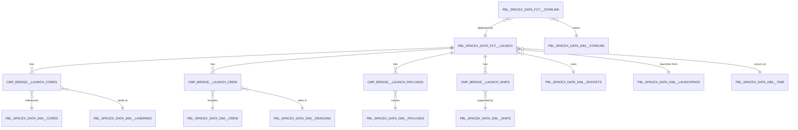

# SpaceX Data Model Documentation

## Schema Overview

### Staging Layer (STG)

Raw data from SpaceX API with minimal transformations.

### Compute Layer (CMP)

Bridge tables and intermediate calculations.

### Published Layer (PBL)

Analytics-ready dimension and fact tables.

## Table Specifications

### Staging Tables

#### STG_SPACEX_DATA_COMPANY

| Column                    | Type          | Description                   |
| ------------------------- | ------------- | ----------------------------- |
| company_id                | VARCHAR       | Unique identifier for company |
| company_name              | VARCHAR       | Company name                  |
| company_founder           | VARCHAR       | Company founder               |
| company_founding_date     | INTEGER       | Year company was founded      |
| company_employee_count    | INTEGER       | Number of employees           |
| company_vehicle_count     | INTEGER       | Number of vehicles            |
| company_launch_site_count | INTEGER       | Number of launch sites        |
| company_test_site_count   | INTEGER       | Number of test sites          |
| company_valuation         | DECIMAL(18,2) | Company valuation in USD      |

#### STG_SPACEX_DATA_LAUNCH

| Column                     | Type      | Description                  |
| -------------------------- | --------- | ---------------------------- |
| launch_id                  | VARCHAR   | Unique identifier for launch |
| launch_date_utc            | TIMESTAMP | Launch date and time         |
| launch_success             | BOOLEAN   | Launch success indicator     |
| launch_rocket_id           | VARCHAR   | Reference to rocket used     |
| launch_details             | VARCHAR   | Launch details               |
| launch_crew_id             | ARRAY     | Array of crew member IDs     |
| launch_payload_id          | ARRAY     | Array of payload IDs         |
| launch_core_serial_numbers | ARRAY     | Array of core serial numbers |

#### STG_SPACEX_DATA_ROCKET

| Column                  | Type          | Description                  |
| ----------------------- | ------------- | ---------------------------- |
| rocket_id               | VARCHAR       | Unique identifier for rocket |
| rocket_name             | VARCHAR       | Rocket name                  |
| rocket_type             | VARCHAR       | Rocket type                  |
| rocket_active           | BOOLEAN       | Active status                |
| rocket_stages           | INTEGER       | Number of stages             |
| rocket_boosters         | INTEGER       | Number of boosters           |
| rocket_cost_per_launch  | DECIMAL(18,2) | Cost per launch in USD       |
| rocket_success_rate_pct | DECIMAL(5,2)  | Success rate percentage      |

### Compute Layer Tables

#### CMP_BRIDGE_LAUNCH_CORE

| Column                       | Type    | Description                         |
| ---------------------------- | ------- | ----------------------------------- |
| bridge_launch_core_id        | VARCHAR | Unique identifier for bridge record |
| bridge_launch_core_launch_id | VARCHAR | Reference to launch                 |
| bridge_launch_core_serial    | VARCHAR | Core serial number                  |
| landing_success              | BOOLEAN | Landing success indicator           |
| landing_type                 | VARCHAR | Type of landing                     |
| landing_vehicle              | VARCHAR | Landing vehicle used                |

#### CMP_BRIDGE_LAUNCH_CREW

| Column                       | Type    | Description                         |
| ---------------------------- | ------- | ----------------------------------- |
| bridge_launch_crew_id        | VARCHAR | Unique identifier for bridge record |
| bridge_launch_crew_launch_id | VARCHAR | Reference to launch                 |
| bridge_launch_crew_member_id | VARCHAR | Reference to crew member            |
| role                         | VARCHAR | Crew member role                    |

#### CMP_BRIDGE\_\_LAUNCH_PAYLOADS

| Column                          | Type          | Description                         |
| ------------------------------- | ------------- | ----------------------------------- |
| bridge_launch_payload_id        | VARCHAR       | Unique identifier for bridge record |
| bridge_launch_payload_launch_id | VARCHAR       | Reference to launch                 |
| bridge_launch_payload_id        | VARCHAR       | Reference to payload                |
| payload_type                    | VARCHAR       | Type of payload                     |
| payload_mass_kg                 | DECIMAL(10,2) | Mass of payload in kg               |
| orbit                           | VARCHAR       | Target orbit                        |

### Published Layer Tables

All dimension tables (except time dimension) implement Type 2 Slowly Changing Dimension (SCD) pattern with:

- Surrogate key for each version of the record
- valid_from/valid_to timestamps for temporal validity
- is_current boolean flag for current version
- Initial load handling with proper null values
- Change detection logic for updates

#### PBL_SPACEX_DATA_DIM\_\_CAPSULES

| Column                 | Type      | Description               |
| ---------------------- | --------- | ------------------------- |
| capsule_surrogate_key  | VARCHAR   | Surrogate key             |
| capsule_id             | VARCHAR   | Natural key               |
| capsule_serial         | VARCHAR   | Serial number             |
| capsule_status         | VARCHAR   | Current status            |
| capsule_reuse_count    | INTEGER   | Number of reuses          |
| capsule_water_landings | INTEGER   | Water landing count       |
| capsule_land_landings  | INTEGER   | Land landing count        |
| valid_from             | TIMESTAMP | SCD Type 2 validity start |
| valid_to               | TIMESTAMP | SCD Type 2 validity end   |
| is_current             | BOOLEAN   | Current record indicator  |

#### PBL_SPACEX_DATA_DIM\_\_COMPANY

| Column         | Type          | Description               |
| -------------- | ------------- | ------------------------- |
| company_id     | VARCHAR       | Primary key               |
| company_name   | VARCHAR       | Company name              |
| founded_date   | DATE          | Company founding date     |
| founder        | VARCHAR       | Company founder           |
| employee_count | INTEGER       | Number of employees       |
| valuation_usd  | DECIMAL(18,2) | Company valuation         |
| valid_from     | TIMESTAMP     | SCD Type 2 validity start |
| valid_to       | TIMESTAMP     | SCD Type 2 validity end   |
| is_current     | BOOLEAN       | Current record indicator  |

#### PBL_SPACEX_DATA_DIM\_\_CORES

| Column             | Type      | Description                    |
| ------------------ | --------- | ------------------------------ |
| core_surrogate_key | VARCHAR   | Surrogate key                  |
| core_id            | VARCHAR   | Natural key                    |
| core_serial        | VARCHAR   | Serial number                  |
| core_block         | VARCHAR   | Block version                  |
| core_status        | VARCHAR   | Current status                 |
| core_reuse_count   | INTEGER   | Number of reuses               |
| core_rtls_attempts | INTEGER   | Return to launch site attempts |
| core_rtls_landings | INTEGER   | Successful RTLS landings       |
| core_asds_attempts | INTEGER   | Drone ship landing attempts    |
| core_asds_landings | INTEGER   | Successful drone ship landings |
| valid_from         | TIMESTAMP | SCD Type 2 validity start      |
| valid_to           | TIMESTAMP | SCD Type 2 validity end        |
| is_current         | BOOLEAN   | Current record indicator       |

#### PBL_SPACEX_DATA_DIM\_\_CREW

| Column             | Type      | Description               |
| ------------------ | --------- | ------------------------- |
| crew_surrogate_key | VARCHAR   | Surrogate key             |
| crew_id            | VARCHAR   | Natural key               |
| crew_name          | VARCHAR   | Crew member name          |
| crew_agency        | VARCHAR   | Space agency              |
| crew_image_url     | VARCHAR   | Image URL                 |
| crew_wikipedia_url | VARCHAR   | Wikipedia URL             |
| crew_status        | VARCHAR   | Current status            |
| valid_from         | TIMESTAMP | SCD Type 2 validity start |
| valid_to           | TIMESTAMP | SCD Type 2 validity end   |
| is_current         | BOOLEAN   | Current record indicator  |

#### PBL_SPACEX_DATA_DIM\_\_DRAGONS

| Column                          | Type          | Description               |
| ------------------------------- | ------------- | ------------------------- |
| dragon_surrogate_key            | VARCHAR       | Surrogate key             |
| dragon_id                       | VARCHAR       | Natural key               |
| dragon_name                     | VARCHAR       | Dragon name               |
| dragon_type                     | VARCHAR       | Dragon type               |
| dragon_crew_capacity            | INTEGER       | Crew capacity             |
| dragon_orbit_duration_yr        | INTEGER       | Orbit duration in years   |
| dragon_dry_mass_kg              | DECIMAL(10,2) | Dry mass in kg            |
| dragon_first_flight_at          | TIMESTAMP     | First flight date         |
| dragon_heat_shield_material     | VARCHAR       | Heat shield material      |
| dragon_heat_shield_size_meters  | DECIMAL(10,2) | Heat shield size          |
| dragon_heat_shield_temp_degrees | DECIMAL(10,2) | Heat shield temperature   |
| valid_from                      | TIMESTAMP     | SCD Type 2 validity start |
| valid_to                        | TIMESTAMP     | SCD Type 2 validity end   |
| is_current                      | BOOLEAN       | Current record indicator  |

#### PBL_SPACEX_DATA_DIM\_\_HISTORY

| Column                   | Type      | Description               |
| ------------------------ | --------- | ------------------------- |
| history_surrogate_key    | VARCHAR   | Surrogate key             |
| history_id               | VARCHAR   | Natural key               |
| history_title            | VARCHAR   | Event title               |
| history_event_date_utc   | TIMESTAMP | Event date                |
| history_details          | VARCHAR   | Event details             |
| history_link_article_url | VARCHAR   | Article URL               |
| history_link_reddit_url  | VARCHAR   | Reddit URL                |
| valid_from               | TIMESTAMP | SCD Type 2 validity start |
| valid_to                 | TIMESTAMP | SCD Type 2 validity end   |
| is_current               | BOOLEAN   | Current record indicator  |

#### PBL_SPACEX_DATA_DIM\_\_LANDPADS

| Column                    | Type          | Description               |
| ------------------------- | ------------- | ------------------------- |
| landpad_surrogate_key     | VARCHAR       | Surrogate key             |
| landpad_id                | VARCHAR       | Natural key               |
| landpad_name              | VARCHAR       | Landpad name              |
| landpad_full_name         | VARCHAR       | Full name                 |
| landpad_status            | VARCHAR       | Current status            |
| landpad_type              | VARCHAR       | Landpad type              |
| landpad_locality          | VARCHAR       | Location locality         |
| landpad_region            | VARCHAR       | Location region           |
| landpad_latitude          | DECIMAL(10,6) | Latitude                  |
| landpad_longitude         | DECIMAL(10,6) | Longitude                 |
| landpad_landing_attempts  | INTEGER       | Landing attempts          |
| landpad_landing_successes | INTEGER       | Successful landings       |
| valid_from                | TIMESTAMP     | SCD Type 2 validity start |
| valid_to                  | TIMESTAMP     | SCD Type 2 validity end   |
| is_current                | BOOLEAN       | Current record indicator  |

#### PBL_SPACEX_DATA_DIM\_\_LAUNCHPADS

| Column                     | Type          | Description               |
| -------------------------- | ------------- | ------------------------- |
| launchpad_surrogate_key    | VARCHAR       | Surrogate key             |
| launchpad_id               | VARCHAR       | Natural key               |
| launchpad_name             | VARCHAR       | Launchpad name            |
| launchpad_full_name        | VARCHAR       | Full name                 |
| launchpad_status           | VARCHAR       | Current status            |
| launchpad_locality         | VARCHAR       | Location locality         |
| launchpad_region           | VARCHAR       | Location region           |
| launchpad_latitude         | DECIMAL(10,6) | Latitude                  |
| launchpad_longitude        | DECIMAL(10,6) | Longitude                 |
| launchpad_launch_attempts  | INTEGER       | Launch attempts           |
| launchpad_launch_successes | INTEGER       | Successful launches       |
| valid_from                 | TIMESTAMP     | SCD Type 2 validity start |
| valid_to                   | TIMESTAMP     | SCD Type 2 validity end   |
| is_current                 | BOOLEAN       | Current record indicator  |

#### PBL_SPACEX_DATA_DIM\_\_PAYLOADS

| Column                   | Type          | Description               |
| ------------------------ | ------------- | ------------------------- |
| payload_surrogate_key    | VARCHAR       | Surrogate key             |
| payload_id               | VARCHAR       | Natural key               |
| payload_name             | VARCHAR       | Payload name              |
| payload_type             | VARCHAR       | Payload type              |
| payload_reused           | BOOLEAN       | Reuse indicator           |
| payload_mass_kg          | DECIMAL(10,2) | Mass in kg                |
| payload_orbit            | VARCHAR       | Orbit type                |
| payload_reference_system | VARCHAR       | Reference system          |
| valid_from               | TIMESTAMP     | SCD Type 2 validity start |
| valid_to                 | TIMESTAMP     | SCD Type 2 validity end   |
| is_current               | BOOLEAN       | Current record indicator  |

#### PBL_SPACEX_DATA_DIM\_\_ROCKETS

| Column                  | Type          | Description               |
| ----------------------- | ------------- | ------------------------- |
| rocket_surrogate_key    | VARCHAR       | Surrogate key             |
| rocket_id               | VARCHAR       | Natural key               |
| rocket_name             | VARCHAR       | Rocket name               |
| rocket_type             | VARCHAR       | Rocket type               |
| rocket_company          | VARCHAR       | Company name              |
| rocket_country          | VARCHAR       | Country of origin         |
| rocket_description      | VARCHAR       | Description               |
| rocket_height_meters    | DECIMAL(10,2) | Height in meters          |
| rocket_diameter_meters  | DECIMAL(10,2) | Diameter in meters        |
| rocket_mass_kg          | DECIMAL(10,2) | Mass in kg                |
| rocket_stages           | INTEGER       | Number of stages          |
| rocket_boosters         | INTEGER       | Number of boosters        |
| rocket_cost_per_launch  | DECIMAL(18,2) | Cost per launch           |
| rocket_success_rate_pct | DECIMAL(5,2)  | Success rate              |
| rocket_first_flight     | DATE          | First flight date         |
| rocket_is_active        | BOOLEAN       | Active status             |
| valid_from              | TIMESTAMP     | SCD Type 2 validity start |
| valid_to                | TIMESTAMP     | SCD Type 2 validity end   |
| is_current              | BOOLEAN       | Current record indicator  |

#### PBL_SPACEX_DATA_DIM\_\_SHIPS

| Column             | Type          | Description               |
| ------------------ | ------------- | ------------------------- |
| ship_surrogate_key | VARCHAR       | Surrogate key             |
| ship_id            | VARCHAR       | Natural key               |
| ship_name          | VARCHAR       | Ship name                 |
| ship_type          | VARCHAR       | Ship type                 |
| ship_roles         | ARRAY         | Array of roles            |
| ship_is_active     | BOOLEAN       | Active status             |
| ship_mass_kg       | DECIMAL(10,2) | Mass in kg                |
| ship_year_built    | INTEGER       | Year built                |
| ship_home_port     | VARCHAR       | Home port                 |
| valid_from         | TIMESTAMP     | SCD Type 2 validity start |
| valid_to           | TIMESTAMP     | SCD Type 2 validity end   |
| is_current         | BOOLEAN       | Current record indicator  |

#### PBL_SPACEX_DATA_DIM\_\_STARLINK

| Column                          | Type          | Description               |
| ------------------------------- | ------------- | ------------------------- |
| starlink_surrogate_key          | VARCHAR       | Surrogate key             |
| starlink_id                     | VARCHAR       | Natural key               |
| starlink_launch_id              | VARCHAR       | Launch reference          |
| starlink_longitude              | DECIMAL(10,6) | Longitude                 |
| starlink_latitude               | DECIMAL(10,6) | Latitude                  |
| starlink_height_km              | DECIMAL(10,2) | Height in km              |
| starlink_velocity_kms           | DECIMAL(10,2) | Velocity in km/s          |
| starlink_spaceTrack_object_name | VARCHAR       | Space track object name   |
| valid_from                      | TIMESTAMP     | SCD Type 2 validity start |
| valid_to                        | TIMESTAMP     | SCD Type 2 validity end   |
| is_current                      | BOOLEAN       | Current record indicator  |

#### PBL_SPACEX_DATA_DIM\_\_TIME

| Column      | Type    | Description          |
| ----------- | ------- | -------------------- |
| full_date   | DATE    | Calendar date        |
| year        | INTEGER | Year number          |
| quarter     | INTEGER | Quarter number (1-4) |
| month       | INTEGER | Month number (1-12)  |
| week        | INTEGER | Week number (1-53)   |
| day         | INTEGER | Day of month (1-31)  |
| day_of_week | INTEGER | Day of week (1-7)    |
| is_weekend  | BOOLEAN | Weekend indicator    |

#### PBL_SPACEX_DATA_FCT\_\_LAUNCH_COSTS

| Column                | Type          | Description              |
| --------------------- | ------------- | ------------------------ |
| launch_id             | VARCHAR       | Primary key              |
| launch_date_utc       | TIMESTAMP     | Launch date and time     |
| rocket_id             | VARCHAR       | Reference to rocket      |
| success               | BOOLEAN       | Launch success indicator |
| total_payload_mass_kg | DECIMAL(10,2) | Total payload mass       |
| launch_cost_usd       | DECIMAL(18,2) | Launch cost              |
| cost_per_kg           | DECIMAL(18,2) | Cost per kg              |
| payload_count         | INTEGER       | Number of payloads       |
| crew_count            | INTEGER       | Number of crew members   |

## Relationships

### Primary Key - Foreign Key Relationships

```mermaid
erDiagram
    PBL_SPACEX_DATA_FCT__LAUNCH ||--o{ CMP_BRIDGE__LAUNCH_CORES : "has"
    PBL_SPACEX_DATA_FCT__LAUNCH ||--o{ CMP_BRIDGE__LAUNCH_CREW : "has"
    PBL_SPACEX_DATA_FCT__LAUNCH ||--o{ CMP_BRIDGE__LAUNCH_PAYLOADS : "has"
    PBL_SPACEX_DATA_FCT__LAUNCH ||--o{ CMP_BRIDGE__LAUNCH_SHIPS : "has"
    PBL_SPACEX_DATA_FCT__LAUNCH }o--|| PBL_SPACEX_DATA_DIM__ROCKETS : "uses"
    PBL_SPACEX_DATA_FCT__LAUNCH }o--|| PBL_SPACEX_DATA_DIM__LAUNCHPADS : "launches from"
    PBL_SPACEX_DATA_FCT__LAUNCH }o--|| PBL_SPACEX_DATA_DIM__TIME : "occurs on"
    CMP_BRIDGE__LAUNCH_CORES }o--|| PBL_SPACEX_DATA_DIM__CORES : "references"
    CMP_BRIDGE__LAUNCH_CORES }o--|| PBL_SPACEX_DATA_DIM__LANDPADS : "lands at"
    CMP_BRIDGE__LAUNCH_CREW }o--|| PBL_SPACEX_DATA_DIM__CREW : "includes"
    CMP_BRIDGE__LAUNCH_CREW }o--|| PBL_SPACEX_DATA_DIM__DRAGONS : "rides in"
    CMP_BRIDGE__LAUNCH_PAYLOADS }o--|| PBL_SPACEX_DATA_DIM__PAYLOADS : "carries"
    CMP_BRIDGE__LAUNCH_SHIPS }o--|| PBL_SPACEX_DATA_DIM__SHIPS : "supported by"
    PBL_SPACEX_DATA_FCT__STARLINK }o--|| PBL_SPACEX_DATA_DIM__STARLINK : "tracks"
    PBL_SPACEX_DATA_FCT__STARLINK }o--|| PBL_SPACEX_DATA_FCT__LAUNCH : "deployed by"
```

## Data Types and Conventions

### Naming Conventions

- Staging tables: STG_SPACEX_DATA\_\_[entity]
- Compute tables: CMP_BRIDGE\_\_[relationship]
- Published tables: PBL*SPACEX_DATA*[DIM/FCT]\_\_[entity]

### Data Types

- Identifiers: VARCHAR
- Dates: DATE or TIMESTAMP
- Numeric:
  - Money: DECIMAL(18,2)
  - Percentages: DECIMAL(5,2)
  - Weights: DECIMAL(10,2)
- Boolean: BOOLEAN
- Text: VARCHAR

### Special Values

- Missing numeric values: NULL
- Unknown dates: NULL
- Invalid identifiers: NULL
- Boolean defaults: FALSE

## Incremental Loading Strategy

### Staging Layer

- Full refresh for small tables
- Incremental load for large tables based on modified_at

### Compute Layer

- Rebuild bridge tables on each run
- Maintain referential integrity

### Published Layer

- Type 2 SCD for dimension tables
- Incremental load for fact tables
