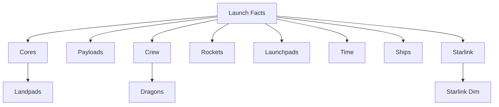

# SpaceX Data Project Documentation

## Table of Contents

1. [Project Overview](#project-overview)
2. [Architecture](#architecture)
3. [Data Pipeline](#data-pipeline)
4. [Data Models](#data-models)
5. [Testing Strategy](#testing-strategy)
6. [Deployment & Operations](#deployment--operations)

## Project Overview

The SpaceX Data Project is a comprehensive data pipeline that extracts data from the SpaceX API, loads it into Snowflake, and transforms it into analytics-ready models using dbt. The project is orchestrated using Apache Airflow via Astronomer's Astro CLI.

### Project Goals

- Extract and store SpaceX mission data
- Create a reliable data warehouse structure
- Enable analytics on SpaceX operations
- Provide clean, tested, and documented data models

### Key Features

- Automated daily data extraction
- Incremental loading
- Data quality testing
- Comprehensive data transformations
- Orchestrated pipeline execution

## Architecture

### Components

1. **Data Extraction (Singer Tap)**

   - Custom Singer tap for SpaceX API
   - Handles incremental loads
   - Outputs structured JSON data

2. **Data Warehouse (Snowflake)**

   - Staging schema (STG)
   - Compute schema (CMP)
   - Published schema (PBL)

3. **Transformation Layer (dbt)**

   - Modular transformation models
   - Testing framework
   - Documentation generation

4. **Orchestration (Airflow)**
   - Task scheduling and dependencies
   - Error handling and retries
   - Monitoring and alerting

### Schema Design

```
STG (Staging)
├── Raw data from API
├── Minimal transformations
└── Source of truth

CMP (Compute)
├── Bridge tables
├── Intermediate calculations
└── Business logic

PBL (Published)
├── Dimension tables
├── Fact tables
└── Analytics-ready views
```

## Data Pipeline

### Extract Phase (Singer Tap)

- **Source**: SpaceX API v4
- **Endpoints**:
  - /company (company information)
  - /launches (mission launches)
  - /rockets (rocket details)
  - /cores (booster cores)
  - /capsules (spacecraft)
  - /crew (astronauts)
  - /payloads (mission payloads)
  - /starlink (Starlink satellites)

### Load Phase (Snowflake)

- **Staging Tables**:
  ```sql
  STG_SPACEX_DATA__LAUNCHES
  STG_SPACEX_DATA__ROCKETS
  STG_SPACEX_DATA__CORES
  STG_SPACEX_DATA__CAPSULES
  STG_SPACEX_DATA__CREW
  STG_SPACEX_DATA__PAYLOADS
  STG_SPACEX_DATA__STARLINK
  ```

### Transform Phase (dbt)

1. **Staging Models**

   - Clean and standardize raw data
   - Apply data type conversions
   - Handle NULL values

2. **Bridge Tables**

   - `cmp_bridge__launch_cores`
   - `cmp_bridge__launch_crew`
   - `cmp_bridge__launch_payloads`
   - `cmp_bridge__launch_ships`

3. **Dimension Tables** (All implement Type 2 SCD pattern)

   - `pbl_spacex_data_dim__capsules` - Capsule history and status
   - `pbl_spacex_data_dim__company` - Company information
   - `pbl_spacex_data_dim__cores` - Core history and reuse
   - `pbl_spacex_data_dim__crew` - Crew member details
   - `pbl_spacex_data_dim__dragons` - Dragon spacecraft details
   - `pbl_spacex_data_dim__history` - Historical events
   - `pbl_spacex_data_dim__landpads` - Landing pad information
   - `pbl_spacex_data_dim__launchpads` - Launch site details
   - `pbl_spacex_data_dim__payloads` - Payload information
   - `pbl_spacex_data_dim__rockets` - Rocket specifications
   - `pbl_spacex_data_dim__ships` - Recovery ship details
   - `pbl_spacex_data_dim__starlink` - Starlink satellite data
   - `pbl_spacex_data_dim__time` - Date dimension (not SCD)

4. **Fact Tables**
   - `pbl_spacex_data_fct__launch` - Primary launch fact table
   - `pbl_spacex_data_fct__launch_costs` - Launch cost metrics
   - `pbl_spacex_data_fct__starlink` - Starlink deployment facts

## Data Models

### Key Relationships



### Model Details

#### Staging Models

- Minimal transformations
- One-to-one mapping with API
- Data type standardization
- JSON field parsing
- Array handling

#### Bridge Tables

- Handle many-to-many relationships
- Maintain referential integrity
- Enable flexible analysis
- Landing success tracking
- Role assignments

#### Dimension Tables

- Type 2 SCD implementation
- Surrogate keys for versioning
- valid_from/valid_to dates
- is_current flag
- Change detection logic
- Initial load handling
- Natural and business keys
- Comprehensive attributes

#### Fact Tables

- Metrics and measures
- Foreign keys to dimensions
- Aggregation ready
- Cost calculations
- Success tracking
- Performance metrics

## Testing Strategy

### Unit Tests

Located in `spacex_project/tests/unit/`:

- `test_launch_costs.sql`: Validates cost calculations
- `test_launch_cores_bridge.sql`: Tests array unnesting

### Data Tests

Located in `spacex_project/tests/data/`:

1. **Generic Tests**

   - Primary key uniqueness
   - Referential integrity
   - Not null constraints
   - Accepted values

2. **Custom Tests**
   - Launch date validation
   - Payload mass bounds
   - Success rate ranges
   - Cost per kg validation
   - Core reuse count validation

### Test Coverage

- Source freshness
- Data quality
- Transformation logic
- Business rules
- Referential integrity

## Deployment & Operations

### Environment Setup

1. Development (DEV)

   - Full refresh allowed
   - All tests enabled
   - Development warehouse

2. User Acceptance Testing (UAT)

   - Incremental loads
   - Subset of production data
   - Testing warehouse

3. Production (PRD)
   - Incremental only
   - Full monitoring
   - Production warehouse

### Monitoring

1. **Data Quality**

   - dbt test results
   - Source freshness
   - Data volume checks

2. **Pipeline Health**

   - Task success rates
   - Runtime duration
   - Error tracking

3. **Resource Usage**
   - Warehouse utilization
   - Query performance
   - Storage consumption

### Maintenance

1. **Daily Operations**

   - Monitor pipeline execution
   - Review error logs
   - Validate data quality

2. **Weekly Tasks**

   - Review performance metrics
   - Update documentation
   - Address technical debt

3. **Monthly Activities**
   - Capacity planning
   - Cost optimization
   - Feature planning

### Disaster Recovery

1. **Backup Strategy**

   - Daily snapshots
   - Version control
   - Configuration backups

2. **Recovery Procedures**

   - Data restoration
   - Pipeline recovery
   - Environment rebuild

3. **Business Continuity**
   - Failover processes
   - Communication plan
   - Escalation procedures
